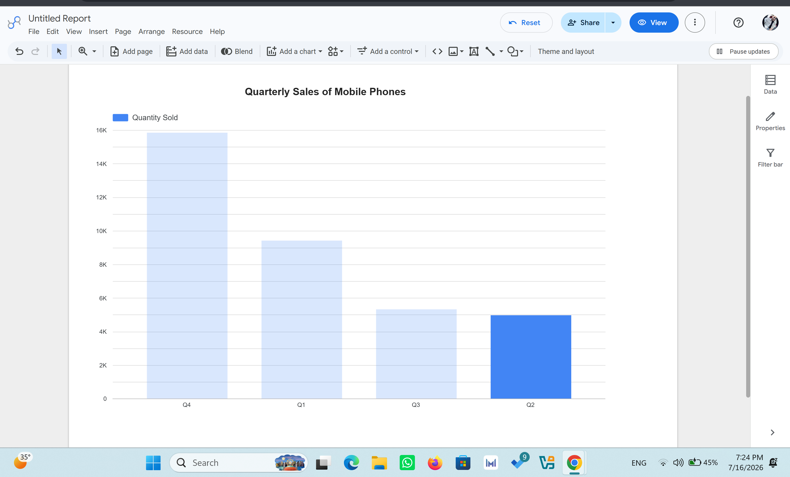
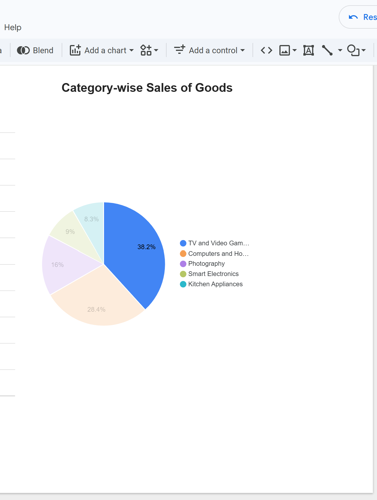
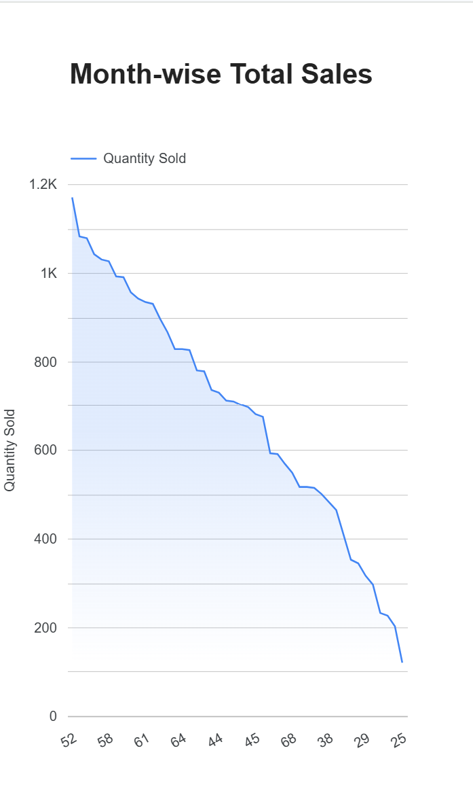

# Hybrid E-Commerce Data Engineering Platform
An IBM-Data-Engineering-Capstone.

---

## Project Overview
This project builds a robust, hybrid data engineering platform for a global e-commerce enterprise. It showcases the design and implementation of an OLTP system, data pipelines, warehousing, and analytics dashboard to optimize sales and operational efficiency.

## Business Problem
The company operates on multi-channel sales without a centralized system, making it difficult to analyze daily sales trends, track stock, or run analytics. Data is siloed in dynamic transactional systems and flat files, preventing real-time or analytical reporting.

## Objectives
- Design and populate a production-grade MySQL OLTP database.
- Implement robust automation scripts for backup and data recovery.
- Establish scalable ETL pipelines to clean, transform, and ingest structured and semi-structured data.
- Build a centralized Data Warehouse for analytical querying.
- Develop an interactive dashboard to visualize KPIs.

## Dataset
- **Name:** `oltpdata.csv` (E-commerce transactional dataset)
- **Features:** Timestamps, transaction IDs, product categories, quantities, store locations, and pricing metrics.

## Technologies
- **OS/Shell:** Linux (Ubuntu), Bash Scripting
- **Database (OLTP):** MySQL
- **Languages & Frameworks:** Python, Pandas, SQL
- **Orchestration & ETL:** Apache Airflow
- **Visualization:** BI Tools / Dashboards
- **Version Control:** Git, GitHub

---

## Architecture

```mermaid
graph LR
    A["📄 oltpdata.csv"] -->|Bash Script / Ingestion| B[("🛢️ MySQL OLTP")]
    B -->|Backup: datadump.sh| C["💾 sales_data.sql"]
    C -->|Python / ETL Pipeline| D["⚙️ Data Cleaning & Transformation"]
    D -->|Loading| E[("🏛️ PostgreSQL Data Warehouse")]
    E -->|Analytics Querying| F["📊 BI Dashboards / Visualization"]

## Module: Data Analytics & Dashboards (Google Looker Studio)

In this module, I designed a reporting dashboard to reflect key business metrics using Google Looker Studio.

### 1. Data Ingestion & Initial Verification
Loaded the dataset and verified the first 10 rows:


### 2. Quarterly Sales of Mobile Phones
Created a column chart showing the quarterly sales filtered specifically for mobile devices:


### 3. Category-wise Sales
Designed a pie chart displaying the distribution of sales across different product lines:


### 4. Month-wise Total Sales
Developed a line chart to track monthly sales performance over a specific year:


## Architecture
```mermaid
```
graph LR
    A["📄 oltpdata.csv"] -->|Bash Script / Ingestion| B[("🛢️ MySQL OLTP")]
    B -->|Backup: datadump.sh| C["💾 sales_data.sql"]
    C -->|Python / ETL Pipeline| D["⚙️ Data Cleaning & Transformation"]
    D -->|Loading| E[("🏛️ PostgreSQL Data Warehouse")]
    E -->|Analytics Querying| F["📊 BI Dashboards / Visualization"]

## Module: Data Analytics & Dashboards (Google Looker Studio)

In this module, I designed a reporting dashboard to reflect key business metrics using Google Looker Studio.

### 1. Data Ingestion & Initial Verification
Loaded the dataset and verified the first 10 rows:


### 2. Quarterly Sales of Mobile Phones
Created a column chart showing the quarterly sales filtered specifically for mobile devices:


### 3. Category-wise Sales
Designed a pie chart displaying the distribution of sales across different product lines:


### 4. Month-wise Total Sales
Developed a line chart to track monthly sales performance over a specific year:

```
