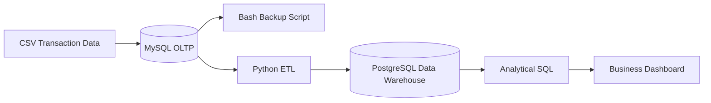

# 🛒 Hybrid E-Commerce Data Engineering Platform

> End-to-End Data Engineering Capstone Project demonstrating database design, ETL development, workflow automation, data warehousing, and business analytics using Python, SQL, Bash, Apache Airflow, MySQL, and PostgreSQL.

---

## 📌 Table of Contents

- [Project Overview](#-project-overview)
- [Business Scenario](#-business-scenario)
- [Business Problem](#-business-problem)
- [Project Objectives](#-project-objectives)
- [Solution Architecture](#-solution-architecture)
- [Project Workflow](#-project-workflow)
- [Technology Stack](#-technology-stack)
- [Dataset](#-dataset)
- [Implementation](#-implementation)
- [Apache Airflow Pipeline](#-apache-airflow-pipeline)
- [Data Warehouse](#-data-warehouse)
- [Business Analytics](#-business-analytics)
- [Repository Structure](#-repository-structure)
- [Skills Demonstrated](#-skills-demonstrated)
- [Business Value](#-business-value)
- [Future Improvements](#-future-improvements)

---

# 📖 Project Overview

This project simulates a real-world Data Engineering workflow for a global e-commerce company.

The objective is to move raw transactional data from operational systems into a centralized analytical environment where business stakeholders can efficiently analyze sales performance, monitor business KPIs, and make data-driven decisions.

The project covers the complete data lifecycle, including:

- Database Design
- Data Ingestion
- Backup Automation
- ETL Development
- Workflow Orchestration
- Data Warehousing
- Analytical SQL
- Dashboard Reporting

---

# 💼 Business Scenario

A multinational retail company generates thousands of sales transactions every day.

Operational data is stored inside transactional databases and CSV files, making it difficult for analysts to generate reports efficiently.

Business managers need a centralized analytical platform capable of answering questions such as:

- Which products generate the highest revenue?
- Which stores perform best?
- How do sales change over time?
- What are the top-selling categories?
- Which locations require inventory optimization?

---

# 🚨 Business Problem

The existing operational environment suffers from several challenges:

- Data scattered across multiple systems
- Manual reporting process
- No centralized analytical database
- Limited historical analysis
- No automated backup strategy
- Raw data requires preprocessing before analysis

---

# 🎯 Project Objectives

- Design a production-ready OLTP database
- Import transactional sales data
- Automate database backup using Bash
- Build ETL pipelines using Python
- Clean and transform raw datasets
- Load processed data into a PostgreSQL Data Warehouse
- Perform analytical SQL queries
- Visualize KPIs using dashboards
- Automate data processing with Apache Airflow

---

# 🏗 Solution Architecture



---

# 🔄 Project Workflow

```text
                    Raw CSV Files
                          │
                          ▼
               MySQL Operational Database
                          │
          ┌───────────────┴───────────────┐
          │                               │
          ▼                               ▼
 Database Backup                   Python ETL Pipeline
 (Bash Automation)                       │
                                         │
                ┌────────────────────────┼───────────────────────┐
                │                        │                       │
                ▼                        ▼                       ▼
          Data Cleaning          Data Validation        Data Transformation
                                         │
                                         ▼
                         PostgreSQL Data Warehouse
                                         │
                                         ▼
                           Analytical SQL Queries
                                         │
                                         ▼
                            Business Intelligence
```

---

# 🛠 Technology Stack

| Category | Technology |
|------------|------------|
| Programming | Python |
| Database | MySQL |
| Data Warehouse | PostgreSQL |
| SQL | MySQL SQL, PostgreSQL SQL |
| Data Processing | Pandas |
| Automation | Bash |
| Workflow | Apache Airflow |
| Operating System | Linux (Ubuntu) |
| Version Control | Git & GitHub |
| Visualization | BI Dashboard |

---

# 📂 Dataset

The project uses an e-commerce transactional dataset containing:

- Transaction ID
- Product ID
- Product Category
- Quantity Sold
- Unit Price
- Store Location
- Date & Time
- Sales Information

---

# ⚙️ Implementation

## 1️⃣ Database Design

- Created relational database schema
- Imported transactional dataset
- Validated data integrity

---

## 2️⃣ Backup Automation

Implemented Linux Bash scripts to automate database backup.

Tasks include:

- Export MySQL database
- Generate SQL dump
- Archive backup files

---

## 3️⃣ ETL Pipeline

Python ETL pipeline performs:

### Extract

- Read CSV files
- Connect to MySQL
- Extract transactional records

### Transform

- Remove duplicates
- Handle missing values
- Convert data types
- Apply business rules
- Standardize formats

### Load

- Load transformed data into PostgreSQL Data Warehouse

---

# 🌬 Apache Airflow Pipeline

Workflow automation is implemented using Apache Airflow.

Pipeline Tasks

```text
Extract
    │
    ▼
Transform
    │
    ▼
Load
    │
    ▼
Archive
```

Each task is scheduled and monitored automatically through Airflow DAGs.

---

# 🏛 Data Warehouse

The analytical database is designed to support reporting workloads.

Benefits include:

- Faster aggregation
- Historical analysis
- Better query performance
- Separation from transactional workloads

---

# 📊 Business Analytics

The Data Warehouse enables business users to analyze:

- Total Revenue
- Daily Sales
- Monthly Sales Trend
- Top Products
- Best Performing Stores
- Product Categories
- Sales by Location

---

# 📁 Repository Structure

```text
Hybrid-Ecommerce-Platform/

│

├── data/

├── sql/

├── python/

├── airflow/

├── bash/

├── dashboard/

├── screenshots/

├── docs/

└── README.md
```

---

# 🚀 Skills Demonstrated

### Data Engineering

- ETL Development
- Data Cleaning
- Data Transformation
- Workflow Automation
- Data Warehousing

### Databases

- MySQL
- PostgreSQL
- SQL

### Programming

- Python
- Pandas
- Bash

### Dev Tools

- Linux
- Git
- GitHub
- Apache Airflow

### Analytics

- Dashboard Design
- KPI Reporting
- Business Intelligence

---

# 💡 Business Value

This solution enables the organization to:

- Centralize business data
- Automate manual processes
- Improve reporting efficiency
- Reduce operational workload
- Support data-driven decision making
- Increase reliability through automated backups

---

# 🔮 Future Improvements

Future enhancements may include:

- Docker containerization
- Incremental ETL
- Cloud deployment (AWS/GCP)
- Apache Spark integration
- Data Quality validation framework
- CI/CD pipeline
- Real-time data ingestion using Kafka

---

# 📷 Project Screenshots

Coming Soon

- MySQL Database
- Airflow DAG
- ETL Execution
- SQL Queries
- Dashboard
- Terminal Output

---

# 👤 Author

**Omar Ragab**

Aspiring Data Engineer passionate about building scalable data platforms, ETL pipelines, and modern Data Warehousing solutions.

---

## ⭐ If you found this project useful, consider giving it a Star.
